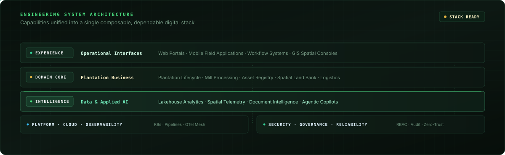

<div align="center">


<br />


# PT Agrinas Palma Nusantara (Persero)

### Rekayasa Teknologi Perkebunan Digital

Membangun ekosistem teknologi yang andal untuk operasional perkebunan, sistem enterprise, kecerdasan geospasial, data, dan AI.

[Website](https://agrinaspalma.co.id/) · [LinkedIn](https://www.linkedin.com/company/agrinas-palma-nusantara/) · [Instagram](https://www.instagram.com/agrinaspalma/) · [X / Twitter](https://x.com/agrinas_palma)

</div>

---

## Teknologi untuk operasional perkebunan nusantara

Agrinas Engineering mengembangkan sistem digital yang menghubungkan aktivitas kerja di lapangan dengan data operasional, proses bisnis korporasi, dan pengambilan keputusan.

Pendekatan kami menitikberatkan pada pemahaman domain kerja, efisiensi alur operasional, ketertelusuran data, serta pemeliharaan sistem jangka panjang.

<br />

<table>
<tr>
<td width="50%" valign="top">

### 01 · Sistem Perkebunan

Alur kerja digital untuk operasional kebun, mulai dari kegiatan lapangan, perencanaan panen, logistik pabrik, manajemen aset, hingga pengawasan biaya.

</td>
<td width="50%" valign="top">

### 02 · Kecerdasan Geospasial

Integrasi data spasial untuk pemetaan lahan, batas konsesi, pemantauan drone, dan analisis spasial pendukung keputusan lapangan.

</td>
</tr>
<tr>
<td width="50%" valign="top">

### 03 · Platform Enterprise

Sistem internal terintegrasi untuk perencanaan kerja, orkestrasi alur proses bisnis, manajemen dokumen, dan akuntabilitas korporasi.

</td>
<td width="50%" valign="top">

### 04 · Data &amp; AI

Fondasi data lakehouse, analitik operasional, pencarian dokumen pintar, dan otomasi AI untuk mendukung analisis keputusan.

</td>
</tr>
<tr>
<td width="50%" valign="top">

### 05 · Rekayasa Platform

Infrastruktur cloud, pipeline otomatisasi CI/CD, keandalan basis data, dan sistem observabilitas untuk stabilitas aplikasi.

</td>
<td width="50%" valign="top">

### 06 · Keamanan &amp; Keandalan

Penerapan keamanan sejak awal desain arsitektur, kontrol akses berbasis peran, perlindungan data, dan audit kepatuhan.

</td>
</tr>
</table>

<br />

## Model operasional terintegrasi



Sistem dirancang mengikuti alur kerja dan hierarki operasional:

**Kebun (Field) → Unit (Estate) → Distrik (District) → Wilayah (Region) → Kantor Pusat (Head Office)**

Didukung kapabilitas bersama pada ranah operasional, data geospasial, sistem enterprise, analitik data, AI, dan keandalan platform.

<br />

## Arsitektur sistem rekayasa



<br />

## Prinsip rekayasa

| No | Prinsip | Penjelasan |
|---|---|---|
| **01** | **Utamakan domain daripada abstraksi** | Pahami alur kerja nyata di lapangan sebelum merancang arsitektur perangkat lunak. |
| **02** | **Andal di atas kebaruan** | Pilih teknologi yang teruji dan stabil di bawah kondisi operasional nyata. |
| **03** | **Keamanan sejak awal** | Rancang identitas, kontrol akses, enkripsi data, dan audit sebagai bagian utama sistem. |
| **04** | **Data sebagai infrastruktur** | Bangun fondasi data yang konsisten dan tepercaya, bukan sekadar laporan terpisah. |
| **05** | **Sistem dapat diobservasi** | Setiap layanan produksi harus dapat dipantau performa dan kesehatannya secara langsung. |
| **06** | **Otomatisasi proses repetitif** | Gunakan perangkat lunak untuk mengurangi koordinasi manual dan redundansi tugas. |
| **07** | **Mudah dipelihara** | Tulis kode dan dokumentasi yang jelas bagi tim yang akan mengelola sistem ke depan. |

<br />

## Integrasi domain dan teknologi

```text
OPERASIONAL    →   Sistem yang selaras dengan alur kerja kebun
GEOSPASIAL     →   Analisis spasial dan pemetaan lahan presisi
DATA           →   Informasi tepercaya di seluruh lini organisasi
AI             →   Otomasi praktis dan dukungan keputusan analitis
PLATFORM       →   Fondasi cloud dan infrastruktur yang stabil
KEAMANAN       →   Kontrol proteksi data dan tata kelola akun
```

<br />

<div align="center">

---

### PT Agrinas Palma Nusantara (Persero)

**Perkebunan · Rekayasa · Teknologi · Indonesia**

[agrinaspalma.co.id](https://agrinaspalma.co.id/)

</div>
