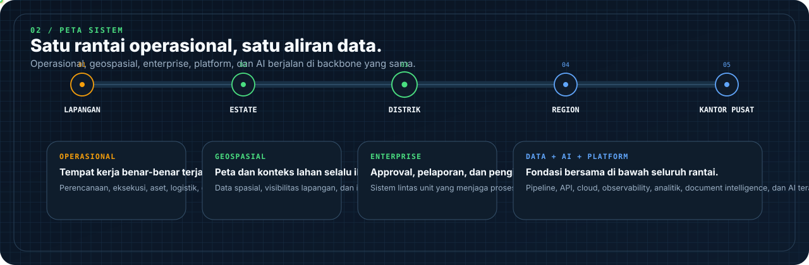

<div align="center">



</div>

# Agrinas Engineering

We build software for plantation operations at scale — from field workflows and geospatial systems to enterprise platforms, data infrastructure, and applied AI.

[Website](https://agrinaspalma.co.id/) · [LinkedIn](https://www.linkedin.com/company/agrinas-palma-nusantara/) · [Instagram](https://www.instagram.com/agrinaspalma/) · [X / Twitter](https://x.com/agrinas_palma)

---

## 01 / What we build

**Operations** — Tools that move work from the field without turning every handoff into spreadsheet ping-pong.

**Geo** — Spatial systems for land, maps, boundaries, drone outputs, and field intelligence.

**Enterprise** — Internal platforms for planning, workflows, assets, documents, and the critical back-office stuff that keeps the operation moving.

**Data + AI** — Search, analytics, document intelligence, automation, and AI where it earns its keep.

**Platform** — Cloud, APIs, databases, observability, security, and the plumbing behind all of it.

<br />

## 02 / One system, end to end



`field -> estate -> district -> region -> head office`

One operational chain. Shared data. Less handoff friction. Better traceability.

<br />

## 03 / How we build

```text
domain > abstraction
reliability > novelty
security != afterthought
observe what we ship
automate the repetitive stuff
ship -> learn -> improve
```

We like boring technology when boring technology works. New things are welcome when they solve a real problem — not just because they're new.

Good software here has to work on Monday morning, not only in an architecture diagram.

<br />

## 04 / Around here

Most days you'll find us around `TypeScript`, `Python`, `PostgreSQL`, `GIS`, cloud infrastructure, data pipelines, and applied AI.

We build for people who actually run the operation, so the software has to survive real workflows, real data, and real constraints.

---

<div align="center">

**PT Agrinas Palma Nusantara (Persero)**

Plantation · Software · Data · Indonesia

[agrinaspalma.co.id](https://agrinaspalma.co.id/)

</div>
