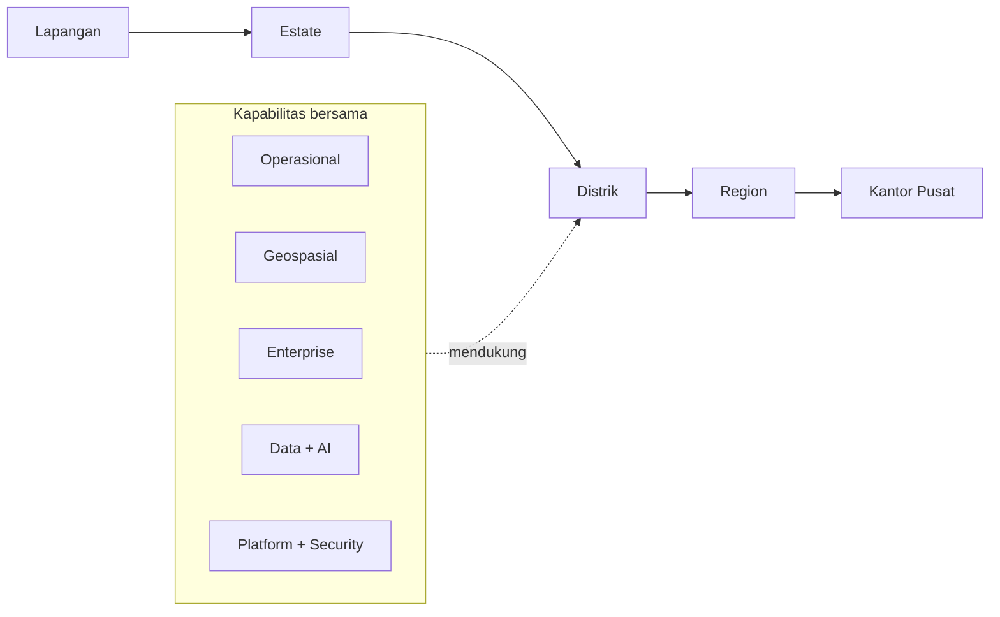

<div align="center">


**PT Agrinas Palma Nusantara (Persero)**

[Website](https://agrinaspalma.co.id/) · [LinkedIn](https://www.linkedin.com/company/agrinas-palma-nusantara/) · [Instagram](https://www.instagram.com/agrinaspalma/) · [X / Twitter](https://x.com/agrinas_palma)

</div>

---

## 01. Engineering untuk operasi nyata

Kami membangun perangkat lunak yang menghubungkan pekerjaan di lapangan dengan proses bisnis, data, dan pengambilan keputusan di kantor pusat.

Fokusnya bukan sekadar digitalisasi formulir. Sistem yang kami bangun harus bisa dipakai dalam workflow nyata, punya jejak data yang jelas, mudah dipantau, dan tetap masuk akal untuk dirawat dalam jangka panjang.

<table>
<tr>
<td width="50%" valign="top">

### Operasional
Perencanaan, budgeting, aktivitas lapangan, aset, logistik, dan workflow harian kebun.

### Geospasial
Peta, data lahan, analisis spasial, GIS, dan konteks lokasi untuk keputusan operasional.

### Enterprise
Approval, pelaporan, dokumen, koordinasi lintas unit, dan proses bisnis internal.

</td>
<td width="50%" valign="top">

### Data + AI
Pipeline data, analytics, document intelligence, pencarian semantik, dan AI terapan.

### Platform
API, cloud, database, observability, CI/CD, security, dan reliability.

### Prinsipnya
Lebih sedikit handoff manual. Data lebih konsisten. Proses lebih mudah ditelusuri. Software lebih mudah dirawat.

</td>
</tr>
</table>

---

## 02. Dari lapangan sampai kantor pusat



Satu rantai operasional, satu konteks data, dan visibilitas yang lebih baik di setiap level organisasi.

---

## 03. Stack yang sering kami pakai

<div align="center">

<picture>
  <source media="(prefers-color-scheme: dark)" srcset="https://skillicons.dev/icons?i=ts,react,nextjs,nodejs,python,fastapi,postgres,docker,aws,git,githubactions&theme=dark&perline=11">
  <source media="(prefers-color-scheme: light)" srcset="https://skillicons.dev/icons?i=ts,react,nextjs,nodejs,python,fastapi,postgres,docker,aws,git,githubactions&theme=light&perline=11">
  
</picture>

</div>

Teknologi bukan tujuan akhirnya. Kami memilih tool berdasarkan masalah yang diselesaikan, kemudahan operasional, keamanan, dan kemampuan tim untuk merawatnya.

---

## 04. Cara kami membangun

```text
domain > abstraksi
keandalan > kebaruan
security sejak desain
ukur apa yang dikirim
otomatiskan pekerjaan berulang
rilis -> observasi -> benahi
```

Kami suka teknologi yang jelas gunanya. Eksperimen tetap penting, tapi harus berujung pada software yang lebih sederhana, lebih aman, atau lebih berguna.

> Software yang bagus harus tetap bekerja di Senin pagi, bukan cuma terlihat bagus di diagram arsitektur.

---

<div align="center">

**Perkebunan · Software · Data · Indonesia**


</div>
