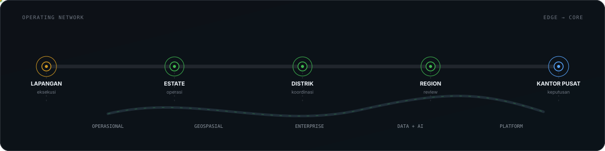
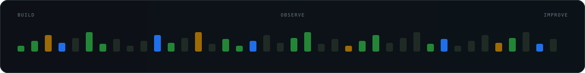

# Agrinas Engineering

**Kami bikin software untuk pekerjaan yang benar-benar jalan di kebun.**

Dari budgeting, aset, dan aktivitas lapangan sampai peta, data, workflow kantor pusat, dan AI.

[Website](https://agrinaspalma.co.id/) · [LinkedIn](https://www.linkedin.com/company/agrinas-palma-nusantara/) · [Instagram](https://www.instagram.com/agrinaspalma/) · [X / Twitter](https://x.com/agrinas_palma)

## Yang kami kerjakan

<table>
<tr>
<td width="50%" valign="top">

### Operasional
Perencanaan, budgeting, aset, logistik, dan aktivitas lapangan. Hal-hal yang harus tetap jalan walau situasi di lapangan nggak selalu ideal.

### Geospasial
Peta, GIS, data lahan, dan konteks spasial. Supaya keputusan nggak cuma berhenti di spreadsheet.

### Enterprise
Approval, dokumen, reporting, dan workflow lintas unit. Banyak proses kecil yang kalau nggak disambung dengan benar bisa bikin kerjaan tersendat.

</td>
<td width="50%" valign="top">

### Data + AI
Pipeline data, analytics, semantic search, document intelligence, dan AI yang dipakai buat ngurangin kerja manual yang nggak perlu.

### Platform
API, cloud, database, observability, CI/CD, security, dan reliability. Bagian yang biasanya nggak kelihatan, tapi kerasa banget kalau bermasalah.

### Intinya
Kami lebih tertarik bikin sistem yang kepakai daripada sekadar kelihatan modern di diagram.

</td>
</tr>
</table>

---

## Dari kebun sampai kantor pusat

Sistemnya beda-beda, tapi alurnya nyambung. Data dari lapangan naik ke level berikutnya, keputusan turun lagi ke operasi, dan semuanya perlu jejak yang jelas.

---

## Teknologi yang sering kepakai

<picture>
  <source media="(prefers-color-scheme: dark)" srcset="https://skillicons.dev/icons?i=ts,react,nextjs,nodejs,python,fastapi,postgres,docker,aws,git,githubactions&theme=dark&perline=11">
  <source media="(prefers-color-scheme: light)" srcset="https://skillicons.dev/icons?i=ts,react,nextjs,nodejs,python,fastapi,postgres,docker,aws,git,githubactions&theme=light&perline=11">
  
</picture>

Stack bisa berubah. Yang kami jaga tetap sama: gampang dipahami, gampang dipantau, aman, dan masuk akal buat dirawat tim.

---

## Cara kami kerja

- Pahami prosesnya sebelum gambar arsitekturnya.
- Kalau teknologi yang sederhana cukup, pakai yang sederhana.
- Security dan observability masuk dari awal, bukan tempelan terakhir.
- Otomatiskan hal repetitif yang bikin orang buang waktu.
- Rilis kecil, lihat hasilnya, lalu benahi.

---

**PT Agrinas Palma Nusantara (Persero)**  
Perkebunan · Software · Data · Indonesia

[agrinaspalma.co.id](https://agrinaspalma.co.id/)

